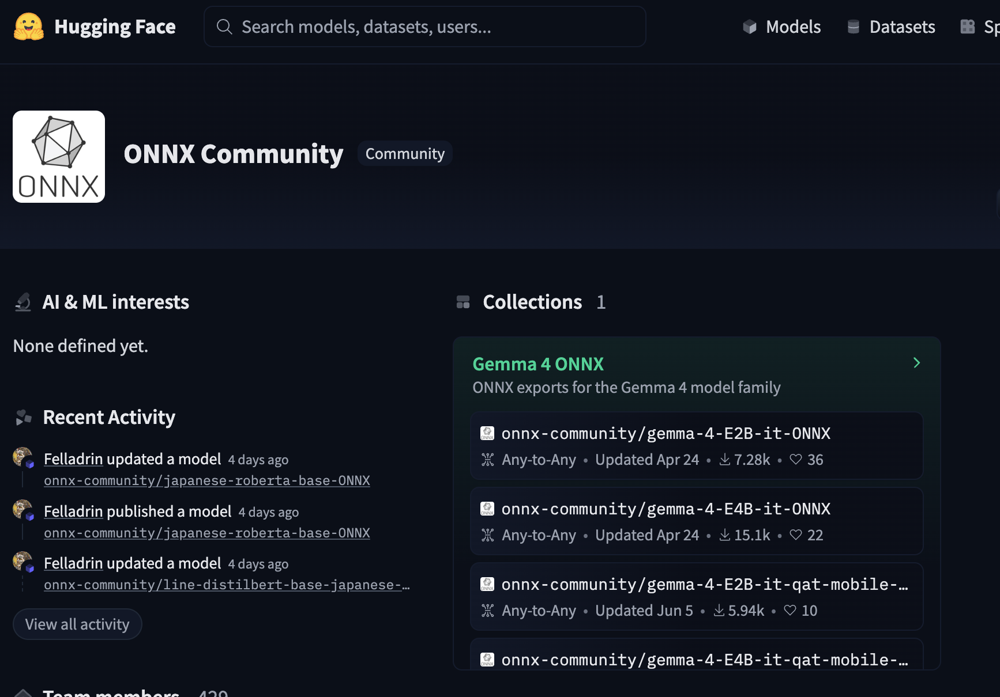

<!-- _class: title  -->
# Running Small AI Models in the Browser
## ONNX and ONNX Runtime Web
22. Sept. 2026 Nobutake Kamiya

---

<!-- _class: headline  -->
# ONNX?


---

<!-- _class: normal  -->

## ONNX = Open Neural Network Exchange

<div class="contents">
<p><a href="https://github.com/onnx/onnx" target="_blank" rel="noopener noreferrer">ONNX</a> is an open standard format for representing machine learning models. ONNX provides an open source format for AI models, both deep learning and traditional ML.</p></div>

---

<!-- _class: normal  -->
## In short...

<div class="contents"><p>Create, train, or fine-tune a model using the framework of your choice, export it to ONNX, and run it with an ONNX-compatible runtime on different platforms.</p></div>

---
<!-- _class: normal -->
## [ONNX Community](https://huggingface.co/onnx-community) on Hugging Face



---

<!-- _class: headline -->

## What is ONNX Runtime Web?

---

<!-- _class: normal -->

## ONNX Runtime Web

<div><p><a href="https://onnxruntime.ai/docs/tutorials/web/" target="_blank" rel="noopener noreferrer">ONNX Runtime Web</a> enables you to run and deploy machine learning models in your web application using JavaScript APIs and libraries.[...]
</p></div>


---


<!-- _class: normal -->
## Running AI Models on the Client Side

<div><p>With ONNX Runtime Web, you can run AI models directly in the browser. Input data can be processed locally without being sent to a server for inference.<br />
ONNX Runtime Web supports WebAssembly for CPU inference and WebGPU for GPU-accelerated inference.</p></div>


---

<!-- _class: normal -->
## Why run AI in the browser?

- Privacy — input data can stay on the device
- Low latency — no network round trip for inference
- Offline — inference can work without a network connection
- Lower server costs — inference uses the client's hardware

---

<!-- _class: normal -->
## But there are trade-offs

- Model download size
- Client CPU/GPU and memory limitations
- Browser compatibility
- Not every ONNX operator is supported by every GPU execution provider


---


<!-- _class: headline -->

## How to use ONNX Runtime Web?

---

<!-- _class: normal -->

## Install with npm
```bash
# install latest release version
npm install onnxruntime-web

```

## Import
```javascript
// WebAssembly (CPU)
import * as ort from 'onnxruntime-web';

// WebGPU
import * as ort from 'onnxruntime-web/webgpu';
```

---

<!-- _class: normal -->

# Initialize the inference session
```javascript
import * as ort from 'onnxruntime-web/webgpu';
const session = await ort.InferenceSession.create('./model.onnx', {
  executionProviders: ['webgpu', 'wasm']
});
```

# Run inference and get the results
```javascript
const results = await session.run(inputs);
// read from results
const data = results.output.data;
```

---

<!-- _class: normal -->
## Example — Object Detection with YOLO26

<div>
  <p>
    <a href="https://github.com/NbtKmy/test_ts_onnx" target="_blank" rel="noopener noreferrer">
    Github repo</a><br />
    <a href="https://nbtkmy.github.io/test_ts_onnx/" target="_blank" rel="noopener noreferrer">Image Object Detection (YOLO26m)</a><br />
    <a href="https://nbtkmy.github.io/test_ts_onnx/realtime_vid.html" target="_blank" rel="noopener noreferrer">Real-time Webcam Object Detection (YOLO26s)</a>
  </p>
</div>

---

<!-- _class: headline  -->
# Thank you!